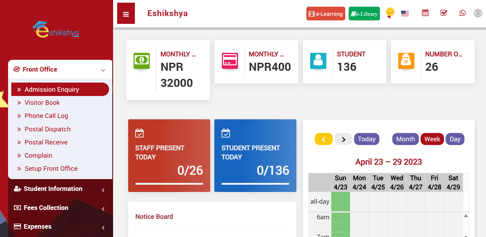
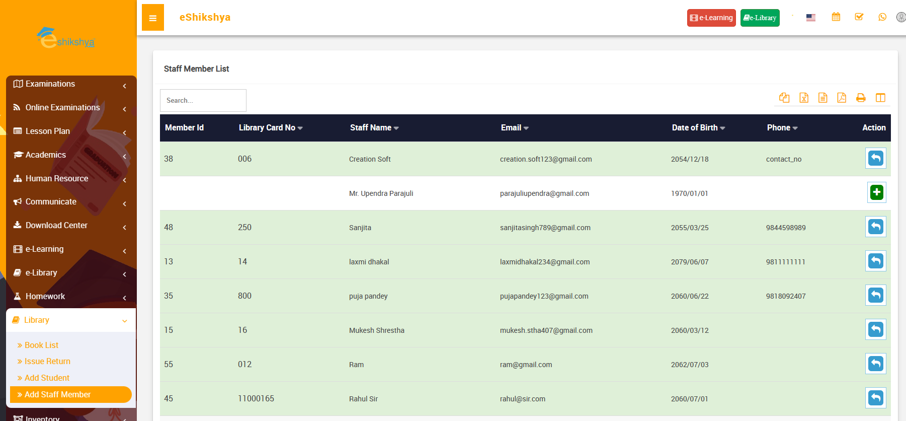

#
##Login
1.	Enter your Username, Password and Click on Sign in to access your account. 
2.	In case you forgot password, Click on Forgot password.
 
<i>Image 1</i>

You should be redirected to this page once you click on Forgot Password:
 
<i>Image 2</i> 
<ol><li>Enter the email linked to your account, a recovery code will be sent to your email.</li>
<li>Enter the recovery code and reset your password. </li></ol>

##Dashboard
Once you login, you should see this page. This is your Dashboard which contains all the data summary and shortcuts to your account. 
 
<i>Image 3</i>
 
<i>Image 4</i>

##System Settings
###General Setting
<ul><li>Setting up your school profile can be done through <b>General Settings</b> under System Settings.
<li>On General settings, you can see the option to add:
<ol><li>School Logo: The school logo is an image or graphic representation that serves as a visual identifier for the school. It is often displayed on official documents, websites, and other materials.
<li>School Name: This is the official name of the school, which is used for identification and branding purposes.
<li>School Slogan: A school slogan is a short and memorable phrase that encapsulates the school's mission, values, or ethos.
<li>School Address: The physical location where the school is situated, including details such as street address, city, state, and postal code.
<li>Phone Number: The contact phone number for the school, which can be used by parents, students, and staff to get in touch.
<li>Email: The school's official email address, often used for communication and correspondence.
<li>Session: Academic Year Setup: This refers to defining the academic year or session duration, including start and end dates.
<li>Session Start Date: The specific date when the academic year or session begins.
<li>Attendance: The option to set up the attendance tracking system, which can be configured as either "Day wise" (daily attendance) or "Period wise" (attendance for specific class periods).
<li>Biometric Attendance: An option to enable or disable the use of biometric technology (such as fingerprint or facial recognition) for tracking attendance.
<li>Devices: This section may involve the management of hardware devices used for various purposes within the school, such as biometric scanners or ID card printers.
<li>Language: The choice of language for the school management system, allowing users to interact with the software in their preferred language, e.g., English or Nepali.
<li>Date Format: The format in which dates are displayed and recorded within the system, such as "dd/mm/yyyy" or "yyyy/mm/dd."
<li>Timezone: Configuring the timezone to ensure that dates and times in the system align with the local time of the school's location.
<li>Start of the Week: Setting the first day of the school week, which may vary from Sunday to Friday or Monday to Friday, depending on the school's schedule.
<li>Calendar: Choosing the type of calendar system to be used, such as the Gregorian calendar (English) or the Nepali calendar.
<li>Currency: Selecting the currency that the school uses for financial transactions and accounting purposes.
<li>Student Admission No. Auto Generation: Setting up the system to automatically generate unique admission numbers for new students.
<li>Staff ID Auto Generation: Configuring the system to automatically generate unique identification numbers for staff members.
<li>Miscellaneous: This section includes additional settings or options that don't fit into the categories above, allowing for customization of various system features such as setting up fees due date, Teacher restricted mode, Duplicate fees envoice, etc. 
<li>Current Theme: Selecting the visual theme or design style for the school management system's user interface.
<li>Dashboard Design: Customizing the layout and content of the system's dashboard, which provides an overview of key information and functions for users. </li></ol>
</li></ul>
 
<i>Image </i> 

###Session Setting
To setup the Academic year that is, was and is going to be in effect into the system. This setup session will be presented in the list selection in General settings.
<ul><li>To add new session, go to Session Setting under System Settings, the following page should appear.</li></ul>
 
<i>Image </i>
<ul><li>On the left side of the page, there is an option to add new academic year.
<li>Enter the year you want to add and click on save. 
<li>The entered year should appear on the list on the right side of the page. </li></ul>

###Notification Setting
<ul><li>To setup Default notifications to promt the system to send notifications for different events, go to Notification settings. The following page should appear.
</li></ul>
 
<i>Image </i> 
<ul><li>As you can see in the Image above, there is a sample message ready for different events such as Student Admission, Exam Result, Fee submission etc. 
<li>In case of the sending notification of student admission, you can select the mode of sending the message from the options given e.g., Email, SMS, etc. 
<li>Similarly, select the mode of sending notifications from the options for each of the events to set up your notification settings and click on save.  </li></ul>

###SMS Setting
You can setup your mode of sending SMS notification here.
<ul><li> To send SMS notifications, you will need an API token from your chosen SMS service provider. If you haven't already, sign up for an SMS service provider and obtain an API token. This token is like a key that allows the school management system to send messages through the SMS service.
<li>To setup the SMS setting, go to SMS setting under System setting. The following page should appear.</li></ul>
 
<i>Image </i>
<ul><li>In the SMS settings, locate the field labeled "API Token". Enter the API token you obtained from your SMS service provider into this field. 
<li>In the SMS settings section, you should see an option to enable or disable SMS notifications. Set the status to "Enable" to activate SMS notifications and click on Save. 
</li></ul>

###Email Setting
You can setup your mode of sending email notification here. 
<ul><li> To send Email notifications, you will need to set uo the Email engine, Username, Password and Server. 
<li>Go to Email setting under System setting. The following page should appear.</li></ul>
 
<i>Image </i>
<ul><li>In the Email Settings section, you will find a drop-down menu to select the email engine or service you want to use. Options include SMTP (Simple Mail Transfer Protocol) or an integrated email service like Gmail or Microsoft Outlook.
<li>If you choose SMTP as your email engine, you'll need to enter the following SMTP details:
<ol><li>SMTP Username: This is the username or email address associated with the SMTP account you plan to use for sending emails.
<li>SMTP Password: Enter the password for the SMTP account.
<li>SMTP Server: Specify the SMTP server address, which is provided by your email service provider. This server is responsible for sending emails.
<li>Click on Save.</li></ol>
</li></ul>

###Payment Methods
You can setup the payment gateway and method here. This is where all your cumilative money for different payments like admission fees, school fees etc. 
<ul><li>You are required to select the payment gateway. 
<li>Then you are rewuired to enter your wallet/ bank username & password and click on save.</li></ul>
 
<i>Image </i>

###Print Header Footer
This features helps you design your payslip, admission receipt and fee receipt. You can manually upload the header and footer you want for each of them. 
<ul><li>Go to Print Header Footer under System settings. The following page should appear.</li></ul>
 
<i>Image </i>
<ul><li>The red circled part on the image shows you the options to navigate through what you want to upload a header and footer to, i.e., Payslip, Admission receipt or Fee receipt. 
<li>Select the option and upload the header in the given space as shown in the image. </li></ul>

###Front CMS setting

###Roles and Permission
In order to manage user restrictions i.e., To allow or disallow access to the modules according to the roles assigned to the staffs.
<li>Go to roles and permissions under <b>System Settings.</b>The following image should appear.
</li></ul>
 
<i>Image </i>
<ul><li>As shown in the image above, To create a new role, type the role name in the given space and click on save.
<li>The created role should appear on the list on the right side of the page.
 </li></ul>
  
<i>Image </i>
<ul><li>The red circled action button on the image above is the "assign permission" button. 
<li>Click on assign permission button next to the role you want to assign permission to. The following page should appear. </li></ul>
  
<i>Image </i>
<ul><li>There are check boxes under the permissions such as view, add, edit and delete. Tick the check boxes for the permissions you want to assign and click on save. </li></ul>

###Backup / Restore
To create a backup of the system data, go to backup/ restore and click on the Create backup option as shown in the image below. 
 
<i>Image </i>

###Language
This feature allows you to choose your mode of language. 
 
<i>Image </i>

###Users

###Modules
Modules is a component that empowers administrators to efficiently manage and customize the modules for the system, student or Parents offering flexibility and adaptability to meet the unique requirements of each account.
<ul><li>Go to modules under system settings, the page shown in the emage below should appear. 
<li>The red circled space the option which allows you to switch between System, Student and Parent. 
<li>Select on student if you want to customize student modules and vice versa. 
<li>On the list of modules you can see and action button to enable or disable the them. 
<li>Enable/ Disable the modules as per your form requirements and click on save. 
 </li></ul>
 
<i>Image </i>

###System Fields
System fields is a component that empowers administrators to efficiently manage and customize the forms for students or teacher details offering flexibility and adaptability to meet the unique requirements of each form.
<ul><li>Go to system fields under system settings, the page shown in the emage below should appear. 
<li>The red circled space the option which allows you to switch between Student and Staff. 
<li>Select on student if you want to customize student form fields and vice versa. 
<li>On the list of fields you can see and action button to enable or disable the fields. 
<li>Enable/ Disable the fields as per your form requirements and click on save. 
</li></ul>
 
<i>Image </i>

###Online Admission
This feature allows you to custozime your online student admission form such as settimg up payment options, fees, Instructions, terms and conditions and customizing field requirements for the form. 
 
<b>Online Admission Form Setting</b>
<ul><li>When you click on online Admission, the following page should appear. </li></ul>
 
<i>Image </i> 
<ul><li>The circled part in the image is the option that allows you to toggle between Online Admission Form setting and Online Admission Fields setting.
<li>On the online Form Setting, you can Add Admission Payment option, Assign Admission fees. 
<li>You are given an entry field to add the admission instructions and terms and conditions. 
<li>After you've written both in the given fields, click on save to update your instructions. </li></ul>
 
<b>Online Admission Field Setting</b>
<ul><li>When you click on the online Admission Fields setting, the following page should appear. </li></ul>
 
<i>Image </i> 
<ul><li>The list of form entry detail requirements and Action button to enable or disable there details should appear. 
<li>For e.g., If you enable "Middle Name" requirement, the online admission form will ask for middle name when in the form, however if you disable the requirement, the form will not ask you to fill up the Middle name. 
<li>Use this feature tp customize the form requirement as per your need and click on save. </li></ul>  

##Front Desk
###Admission Enquiry

 
<i>Image 5</i>

<b>Add admission enquiry form:</b> 
Fill the details and click on save. The saved details should appear on the List of Admission Enquiries Shown in Image 5.

 
<i>Image 6</i>

###Visitor Book
To check the Visitor List or Add new visitor, Go to Visitor book under Front Office. 

 
<i>Image 7</i>
 
<i>Image 8</i>

###Phone Call log
To check the Phone Call log or Add new Phone call log, Go to Phone Call Log under Front Office. 
 
<i>Image 9</i>

 
<i>Image 10</i>

###Postal Dispatch
To check the Postal Dispatch history or Add new Postal Dispatch log, Go to Postal Dispatch under Front Office. 
 
<i>Image 11</i>
 
<i>Image 12</i>

###Postal Receive
To check the Postal Received history or Add new Postal Receive log, Go to Postal Receive under Front Office. 

<i>Image 13</i>
 
<i>Image 14</i>

###Complain
To view the list of complaints or add new complaints, go to Complain under Front Desk.

<i>Image 15</i>

<i>Image 16</i>

###Setup Front Office
All the list Selection Options in the Front Office field can be set up here. For example, in image 7, Purpose field is a list selection. The list options for Purpose can be set up here.
Same goes for Complain type, Source and Reference. 

<i>Image 17</i>

##Student Information
###Student Details
To narrow down the student searches, Search using filters e.g., Class, Section or Keyword. 

<i>Image 18</i>

Here, Choosing Class 2 to Search gives you the list of students in the 2nd Grade. If you want a Detailed Student Summary, click on Detail View.

<i>Image 19</i>

When clicked on Detail view, it gives you the detail of the students studying in the specific grade, as shown in the screenshot below. 

<i>Image 20</i>
###Student Admissions
In order to add new student admission data, Go to Student Admission under Student Information and Fill in the required Fields.

<i>Image 21</i>

This page should appear once you click on Import Student. 

<i>Image 22</i>

When you scroll down you will find a space to Fill the Class, section field and upload the CSV file. Fill the class and section field, upload your file in the given space and click on Import Student. This will save your student detail file according to Class and section. 

<i>Image 23</i>

###Online Admission
Under Student Information, Click on Online Admission to view the list of Online Admission Requests, Student details and Admission fee payment status, Enrollment status.

<i>Image 24</i>

###Class

<i>Image 25</i>

###Section

<i>Image 27</i>

###Delete Students
Search the student you want to delete with the filter. Once you find the student, select and click on delete. 

<i>Image 28</i>

###Student Categories

<i>Image 28</i>

###Student House

<i>Image 29</i>

###Dropout Students
###Dropout Reason

##Fees Collection
###Print Monthly Fees
To Generate monthly fees of students, Go to <b>Print Monthly Fee</b> under <b>Fees Collection. </b>  
Click on the check box next to <b> Admission No.</b> to select all students or Select the check box next to the Admission No. of the Student you want to choose.  
Then click on <b>Generate.</b>

<i>Image 30</i> 
The Following Page should appear once you click on Generate. Click on <b>Print</b> if you want  to Print the Fees. 

<i>Image 31</i>

###Collect Fees
To update fee collection; Go to <b>Collect Fees</b> under <b>Fees collection.</b> 
Search according to class/ section. 
Select the student From the list shown and click on <b>Collect Fees.</b>

<i>Image 32</i> 
Click on <b> Show All</b> to view the Fee history.

<i>Image 33</i> 
This page should appear once you click on <b> Show All.</b>  
It shows all the fees history including paid/due/partially paid.  

<i>Image 34</i> 
<b>Pay All</b>  
In reference to Image 34, when you click on <b>Pay All</b>, you see a pop up as shown in the picture below. Update the amount and click save. This will clear all the remaining due fees.
  
<i>Image 35</i> 
<b>Pay Selected</b>  
In reference to Image 34, click on the check box on the left to the fee you want to select and click on <b>Pay Selected.</b> This will give you a pop up as shown in the picture below. Update the amount and click save. 

<i>Image 36</i> 
<b>Print Selected</b>  
In reference to Image 34, click on the check box on the left of <b>Fees Group</b> to select all fees from the list OR click on the check box left to the fee you want to select and click on <b>Print Selected.</b> This will give you the receipt of all the selected fees in a printable format. 

<i>Image 37</i> 
<b>Print Today</b>  
In reference to Image 34, click on <b>Print Today</b> to get the receipt of all due fees in a printable format. 

<i>Image 38</i> 

###Assign Fees. 
In reference to the Image 39:   
<ul><li>Different Fee subgroups can be created here.</li>
<li>Select Fee group and Fee type. Enter the fee amount.</li>
<li>If there is a fine to be added, select fine type. </li>
<li>Select <b>percentage</b> if fine type is in percentage. </li>
<li>Enter the percentage, the fine amount will automatically be calculated. </li>
<li>If it is a fix amount, select on <b>Fix amount</b> on <b>Fine Type.</b></li>
<li>Enter the fine amount in the entry field. </li>
<li>Click on save. </li>
<li>The updated fee group should appear on the <b>Fees Master List.</b></li>
<li>Click on the Assign/View student icon under <b>Action.</b></ul>

<i>Image 39</i> 

You should be redirected to the page shown in Image 40 once you click on <b>Assign/ View student</b> icon.

<i>Image 40</i> 
<ul><li>Enter the class, section, month you want to assign the fees to and click on search. </li></ul>

<i>Image 41</i> 
<ul><li>Click on the check box left to <b>All</b> or click on the checkbox left to the student you want to assign the fee to.</li>
<li> Click on <b>Save.</b></li></ul>

###Fees Title
The Created Fees Group appears in the <i>Fees Group List selection</i> shown in Image 40. 
If the list of options in <b>Fees Group</b> in <b>Assign fees</b> lacks something, new option can be added here.

<i>Image 41</i> 

###Fees Type
The created Fees Type appears in the <i>Fees Type List selection</i> shown in Image 40. 
If the list of options in <b>Fees Type</b> in <b>Assign fees</b> lacks something, new option can be added here.

<i>Image 42</i> 

###Fees Waiver
<ul>
<li>Select class, block and fee type and click on search.</li>
<li>List of students should appear as shown in the image below.</li>
<li>Select on the student you want to assign the waiver to.</li>
<li>Click on <b>Save.</b></li>
</ul>

<i>Image 43</i> 

###Fees Carry Forward

<i>Image 44</i> 

###Fee Reminder

<i>Image 45</i> 

###Search Due Fees
<ul>
<li>To search students who are yet to pay the fees, Select the fee group and class. 
<li>If there are student with fees due, a list should appear.</li></ul>

<i>Image 46</i> 

##Expenses
###Add Expenses
Expense are all the spedings done for the school e.g., maintainance costs, vehicle fuel, school supplies, etc. 
<ul>
<li>To add school expenses, go to Add expense. </li></ul>

<i>Image 47</i> 

###Search Expenses
Updated expenses are listed here according to it name, invoice number, date and amount. To search expense, input search type: time. 

<i>Image 48</i> 

##Attendance
###Search Attendance
To mark student attendance or check student attandance history, Search attendance under Attendace.  

<i>Image 49</i> 

###Approve Leave
<ul><li>To view student leave requests, go to <b>Approve leave</b> under <b>Attendance</b>.
<li> 

<i>Image 50</i> 
<ul><li>To add new leave request, click on <b>Add+</b> on the top right of the page. </li></ul>
<li>Image 51 is the form that appears when you click on <b>Add</b>. 
<li>Enter the details and click on save. </li></ul>

<i>Image 51</i> 

##Examinations
###Exam group
Schools follow different examination patterns such as grading, percentage, GPA. These patterns can be defined here in class group. 
<ul><li>Go to <b>Exam Groups</b> under <b>Examinations</b>.
<li>Image 52 is the page that appears when you click on <b>Exam Groups</b>. 
<li>Right side has the list of pre defined Exam group list. 
<li>Left side of the page contains the form to define exam group. 
<li>Enter the details and click on <b>save.</b> </li></ul>

<i>Image 52</i> 
###Exam Schedule
<ul><li>Go to <b>Exam Schedule</b> under <b>Examinations</b>.
<li>Enter the exam group and exam to search examination schedule for a specific class.</li></ul>

<i>Image 53</i> 
###Exam Result
<ul><li>Go to <b>Exam Result</b> under <b>Examinations</b>.
<li>Enter the Exam group, class and exam to search result for specific class.</li></ul>

<i>Image 54</i> 
###Design Admit Card
<ul><li>Go to <b>Design Admit Card</b> under <b>Examinations</b>.
<li>Enter the Exam group and exam to search examination schedule for a specific class.</li></ul>

<i>Image 55</i> 

<i>Image 56</i> 
###Print Admit Card

###Design Marksheet
<ul><li>Go to <b>Design Marksheet</b> under <b>Examinations</b>.
</li></ul>

<i>Image 55</i> 

<i>Image 56</i> 

<i>Image 57</i> 

###Marks Grade
<ul><li>To define grades and percentage, go to <b>Marks Grade</b> under Examination. 
<li>Select exam type, name Grade neme(e.g., A+, A, B, etc), Percentage range, grade point and click on save. 
<li>The defined grades should appear on the grade list shown in image 58.
</li></ul>

<i>Image 58</i> 

##Online Examination
###Online Exam
You can set up online exam questionaire, schedule and marking pattern here. 
<ul><li></li></ul>

<i>Image 58</i> 

###Question Bank
<ul><li>You can set up examination questions here. </li></ul>

<i>Image 59</i> 
<ul><li>Click on Add question. The form shown in image 60 should appear.
<li>You can assign questions accorting to its type i.e. multiple chouce, descriptive, etc. Level of question difficulty, subject, class and sections. 
<li>If you want to add image to your question, click on add image which is on the top right of the question entry field. 
<li>Click on save. </li></ul>

<i>Image 60</i> 
<ul><li>With reference to image 59, click on Import to import your questions file. The form on image 61 should appear. 
<li>The file you upload should match the sample question upload file. To download the sample question upload file, click on the red button next to upload button. 
<li>You can assign questions accorting to subject, class and sections and attach question file and click upload. </li></ul>

##Lesson Plan
###Manage Lesson Plan
To view the assigned lesson plan for each teacher, go to manage lesson plan. Select the teacher from the list selection and click on search.  
This should show you the selected teacher's lesson plan. 

<i>Image 61</i> 

###Manage Syllabus Status
<ul><li>Select criteria i.e. Choose the class, section, subject group and subject of which you want to set the status for. 
<li>For example, in the image below, I have chosen to view the syllabus status of class 4 A, for maths. Once you click on search, The syllaus status list should appear. 
<li> As you can see, the status shows incomplete. 
<li> If you want to change status to completed, click on  the Action button. A pop up to add the cyllabus completion date should appear.
<li>Enter the completion date adn click on save. </ul>

<i>Image 62</i> 

###Lesson
To add new lesson go to lesson under Lesson Plan. You should be directed to the page shown in image 63.

<i>Image 63</i> 
<ul><li> Enter class, section, subject group, Subject name and Lesson name. 
<li> Click on save.
<li>The added lesson should appear in the list shown in the right side of the page. </li></ul>

###Topic
To add a new topic, go to topic under Lesson plan. You should be directed to the page shown in image 64.  

<i>Image 64</i> 
<ul><li> Select class, section, subject group, Subject name, Lesson name from the list and enter its topic name. 
<li> Click on save.
<li>The added Topic should appear in the list shown in the right side of the page. </li></ul>

##Academics
###Class Timetable
<ul><li>To view class timetable, go to Class timetable under Academics. 
<li>Choose the class and section from the list selection and click on search. 
<li>The schedule for the selected class should appear as shown in image 65. </li></ul>

<i>Image 65</i> 

###Teachers Timetable
<ul><li>Go to Teacher's timetable under Academics. 
<li>Choose the Teacher from the list selection and click on search. 
<li>The schedule for the selected teacher should appear as shown in image 66. </li></ul>

<i>Image 66</i> 

###Assign Class Teacher
<ul><li>To Assign Class teacher, go to Assign Class teacher under Academics. 
<li>In the form shown in the left side of the page, select class, section from list selection. 
<li>Select the name to the Class teacher for that class and click on save. 
<li>The Assigned class teacher shpuld appear on the list shown in  the right side of the page.</li></ul>

<i>Image 67</i> 

###Promote Students
<ul><li>To promote student who have passed from one grade to another, go to <b>Promote Students</b> under <b>Academics</b>.
<li>Select the class and section of the students you want to promote. 
<li>Select the session, class and section you want to promote them to. 
<li> For example, in the screenshot below, I've chosen students of class 2 'A' and chosen the session 2080-81 class 3 'A'. 
<li>The list of students of class 2'A' will appear. 
<li>Select on the checkbox next to admission no of your selected student and click on promote. 
<li>The student will be assigned to class 3 'A' for the session 2080-81. 
</li></ul>

<i>Image 68</i> 

###Subject Group
<ul><li>To assign subject groups to each class, go to subject group.
<li>Write the name of the subject group, select class.
<li>Select the subjects to assign to that class.
<li>Click on save. 
</li></ul>

<i>Image 69</i> 

###Subjects
<ul><li>The subjects that are assigned to subject groups can be defined here.
<li>To define subjects, go to subjects under Academics. 
<li>Enter the subject name and select its type (theory or practical).
<li>Enter its subject code and click on save. </li></ul>

<i>Image 70</i> 

##Human Resource
###Staff Directory
<ul><li>To view the staff details, go to staff directory.
<li>A page with role search should appear. 
<li>Select the Role from the role list i.e. teacher, librarian, canteen staff etc. 
<li>Once you select the role and click on search, the teacher with card view/ list view should appear. 
</li></ul>

<i>Image 70</i> 

###Staff Attendance 
<ul><li>To view the staff details, go to Staff Attendance.
<li>A page with role search should appear. Suppose you select Teacher as a role, then a list of teachers will appear along with options to mark preset, absent, leave, half day. 
<li>Select the attendance status for the teacher you want to.
<li>Click on save. The attendance status will be updated. 
</li></ul>

<i>Image 71</i> 

###Payroll
<ul><li>To generate staff payroll, go to payroll under Human Resource. 
<li>A page with filter with role, month, as shown in image 72 should appear. </li></ul>

<i>Image 72</i>  
<ul><li>Suppose you select Teacher as a role, then a list of teachers will appear where you'll see and action button next to the name of your selected teacher.
<li>Click on generate, you will be directed to the following page. </li></ul>

<i>Image 73</i>  

<i>Image 74</i>  
<ul><li>Enter the salary details for the selected teacher and click on save. </li></ul>

###Leave Request
<ul><li>To check for staff leave request, approve/ reject them or add new leave request, go to Leave request under Human resource. 
<li> The list of existing leave requests with an option to approve from staffs should appear as shown in the image below. </li></ul>

<i>Image 75</i>  
<ul><li> As you can see on the top right, there is an option to Add new leave request. 
<li> Click on it. The following image should appear. </li></ul>

<i>Image 76</i>  
<ul><li>Fill out the form like role, name, leave apply dates, reason and click on save. </li></ul>

###Leave type
<ul><li>To create leave type, go to Leave type under Human resource. 
<li>A form on the left side to define the leave type should appear. 
<li>Leave types are different types of leaves your institution offers; e.g., sick leave, mourning leave, etc. 
<li>Your created leave appears on the right side of the screen in a listed format. </li></ul>

<i>Image 77</i>  

###Department
<ul><li>To define the different departments in your instituion, go to department under Human Resources.
<li>The image in image 78 should appear. 
<li>On the left side of the page, you should see an option to enyter the Department name. 
<li>Enter the name and click on save. 
<li>The created department should appear on the list shown in the right side of the page. </li></ul>

<i>Image 78</i>  

###Designation
<ul><li>To define the different designations in your instituion, go to designation under Human Resources.
<li>The image in image 79 should appear. 
<li>On the left side of the page, you should see an option to enter the Designation name. 
<li>Enter the name and click on save. 
<li>The created designation should appear on the list shown in the right side of the page. </li></ul>

<i>Image 79</i>  

###Disabled Teachers
###HR Setting
###Staff Indexing

##Communicate

###Notice Board
<ul><li>To customize the notice board for your dashboard, go to Notice board under Communicate on the nav bar. 
<li> The page shown in image 80 should appear.</li></ul>

<i>Image 80</i>  
<ul><li>All the exististing created notices should appear here.
<li>To add new notice, go to <b>Post new message</b> on your top right. 
<li>The page shown in image 81 should appear. 
<li>Enter the details like date of notice publish, Title, description of the notice and who the notice is for. 
<li>Then Click on Send. 
<li>The notice will be displayed on the scheduled date on dashboard on the selected group, i.e., teacher, staff, admin, student etc. 
</li></ul>

<i>Image 81</i> 

###Send Email
<ul><li>To send emails on bulk to selected groups, go to <b>Send Email</b> under communicate. 
<li> Here, you can select the group you want to send email to. e.g., students, guardians, admins, etc. 
<li> If you have an attachment file to send along with the, click on the attachment section. 
<li>Type the message you want to send in the message box. 
</li></ul>

<i>Image 82</i> 

###Send SMS
<ul><li>To send SMS on bulk to selected groups, go to <b>Send SMS</b> under communicate. 
<li> Here, you can select the group you want to send email to. e.g., students, guardians, admins, etc. 
<li>Type the message you want to send in the message box. 
</li></ul>

<i>Image 83</i> 

###Email/ SMS Log
<ul><li>To view Email/ SMS logs, go to Email/ SMS logs under communicate. 
<li> Here, you can view the list of Emails/ SMS categorized on basis of who they are sent to. e.g., Group, individual etc. and their sending date. 
</li></ul>

<i>Image 84</i> 

##Library

###Book List
<ul><li>To add new book to the library, go to <b>Book List</b> under Library.
<li>On this page, you should see a list of existing books, book title, book number and publisher.</li></ul>

<i>Image 85</i>  
<ul><li>On the top right, there is a <b>+ Add book</b> button.
<li>Click on that to add new book, the following page should appear. 
</li></ul>

<i>Image 86</i> 
<ul><li>Enter all the necessary fields like book name, number, etc and click on save. 
<li>If you want to upload CSV file containing book details, click on <b>Import book</b>
on the top right of the page, the following page should appear. </li></ul>

<i>Image 87</i> 
<ul><li>On the top right of the page, you should see should see a  <b>Download sample import file</b>.
<li>Click there to download the format to input data in a readable CSV file. 
<li>On the CSV enter the book details and save. 
<li>Now, upload this file on the Import book page. </li></ul>

###Issue/Return
The Issue/ Return feature ensures you keep track of all the books in the library. 
<ul><li>To issue or return books, go to <b>Issue/Return</b> under Library. The following page should appear. </li></ul>

<i>Image 88</i> 
<ul><li>The list of all library members should appear with an action button the right corner. 
<li>Click on the action button next to the person you want to issue/ return the book to. The following page should appear. </li></ul>

<i>Image 89</i> 
<ul><li>To issue a book to this member, select book from list selection on Books.
<li>Enter the return date for the book and click on save. 
<li>The issued book should appear on the list of Issued books on the same page. 
<li>On the list of issued books, If the book has not been retured yet, There should be an action button to return book.
<li>Click on the Return book action button to return the book. </li></ul>

###Add Student 
<ul><li>To Add Students to library membership, go to <b>Add Student</b>. The following page should appear.</li></ul>

<i>Image 90</i> 
<ul><li>Click on <b>+</b> Action button next to the name of the student you want to add. 
<li>A pop up to enter library card number as shown in the image below should appear. </li></ul>

<i>Image 91</i> 
<ul><li>Enter the library card number and click on save.</li></ul>

###Add Staff 
<ul><li>To Add Staff to library membership, go to <b>Add Staff</b>. The following page should appear.</li></ul>

<i>Image 92</i> 
<ul><li>Click on <b>+</b> Action button next to the name of the student you want to add. 
<li>A pop up to enter library card number as shown in the image below should appear. </li></ul>

<i>Image 93</i> 
<ul><li>Enter the library card number and click on save.</li></ul>

##Inventory

###Issue item
You can keep the track of all the issued items and their details such as when they were issued and who they were issued by. This helps you keep an updated data in a managed format. 
<ul><li>To issue item or view the list of issues items, go to <b>Issue item</b> under Inverntory. The following page should appear.</li></ul>

<i>Image </i> 
<ul><li>As you can see on the image, there's a list of issued items with details such as when they were issued, who they were issued by and the quantity. 
<li>On the top right of the page, there are two options, <b>Issue Item Staff</b> and <b>Issue Item Students. </b>
<li>If you want to add Staff issued item them click on Issue item Staff.  The following page should appear.</li></ul>

<i>Image </i> 
<ul><li>Fill the fields of required information such as:
<ol><li>User type: Type of staff that issued an item e.g., Librarian, Receptionist, Teacher, etc. 
<li>Issued to: Name of the person who issues the item. 
<li>Issued by:
<li>Issue date:
<li>Return Date:
<li>Note: 
<li>Item Category: e.g., book, stationary, etc.
<li>Item: e.g., a4 paper, pencil, notebook, etc. 
<li>Quantity: Number of the items issued. </li></ol>
<li>After you have filled up everything, click on save.</li></ul>

###Add Item Stock
To update the items available in the inventory, go to Add Item Stock. The following page should appear.

<i>Image </i> 
<ul><li>The left side of the page contains a form to Add Item stock.
<li>You are required to fill details regarding the item such as 
<ol><li>Item Category: List selection
<li> Item: List selection
<li>Supplier: List selection
<li>Store: List selection
<li>Quantity
<li>Purchase price
<li>Date
</li></ol>
<li>Once you click on save.
<li>The created item stock should appear on the list shown on the right side of the page. </li></ul>

###Add Item
<ul><li>Add Item stock requires you to select item from a list. The list can be set up in <b>Add Item</b> under Inventory. The following page will appear. </li></ul>

<i>Image </i> 
 <ul><li>On the left side of the page, you can see a form to add items. It requires you to add the following details:
 <ol><li>Item: Name of the Item
 <li>Item category: List selection of what category the item falls in; i.e., stationary, kitchen, etc. 
 <li>Unit: 
 <li>Description: Give a desciption or side note if needed. 
 </li></ol>
<li>After you fill in the details, click on save. 
<li>The added Item should appear on the list of Items on the right side of the page with item details such as Item name, category, unit and quantity. </li></ul>

###Add Category
<ul><li>Add Item category requires you to select category from a list. The list can be set up in <b>Add Category</b> under Inventory. The following page will appear. </li></ul>

<i>Image </i> 
 <ul><li>On the left side of the page, you can see a form to add category. It requires you to add the following details:
 <ol><li>Item Category: Name of the Category
 <li>Description: Give a desciption or side note if needed. 
 </li></ol>
<li>After you fill in the details, click on save. 
<li>The added Category should appear on the list of Categories on the right side of the page. </li></ul>

###Item Store
<ul><li>Add Item store requires you to select category from a list. The list can be set up in <b>Add Category</b> under Inventory. The following page will appear. </li></ul>

<i>Image </i> 
 <ul><li>On the left side of the page, you can see a form to add Item Store. It requires you to add the following details:
 <ol><li>Item Store Name: Name of the Category
 <li>Item Stock code:
 <li>Description: Give a desciption or side note if needed. 
 </li></ol>
<li>After you fill in the details, click on save. 
<li>The added Item Store should appear on the list of Item Store on the right side of the page.</li></ul>

###Item Supplier
<ul><li>Add Item supplier requires you to select category from a list. The list can be set up in <b>Item Supplier</b> under Inventory. The following page will appear. </li></ul>

<i>Image </i> 
 <ul><li>On the left side of the page, you can see a form to add Item Supplier. It requires you to add the following details:
 <ol><li>Name: Name of the Supplier
 <li>Phone: Supplier Phone number
 <li>Email: Supplier email
 <li>Address: Supplier address
 <li>Contact person name: Contact person of the supplier
 <li>Contact person phone: Giver person's phone number
 <li>Contact person Email: Given person's email
 <li>Description: Give a desciption or side note if needed. 
 </li></ol>
<li>After you fill in the details, click on save. 
<li>The added Item Supplier should appear on the list of Item Suppliers on the right side of the page.</li></ul>

##Transport 

###Routes
<ul><li>In order to define the school bus routes, go to Route under Transport. The following page should appear.</li></ul>

<i>Image </i> 
<ul><li>The form on the left side of the page requires you to fill the following details: 
<ol><li>Route title: Name of the route
<li>Fare: Fare for the route</li></ol>
<li> Click on safe after you've filled up the form.
<li> The created route title should appear on the right side of the page as shown in the image below.</li></ul>

<i>Image </i> 
<ul><li>The red circles option is an option that allows you to assign vehicle to students. </li></ul>

###Vehicle
Vehicle details need to be added to the system in order to assign them to students and manage school bus record. In order to add vehicle go to <b>Vehicles</b> under transport. The following page should appear. 

<i>Image </i> 
<ul><li>On the left side of the page, you can see a form ti add vehicle details like Vehicle number, model, Driver name, Driver lucence, contact. 
<li>Enter all the required details and click on save. 
<li>The created Vehicle detail should appear on the right side of the page as shown in the image. 
<li>Next to the Vehicle you have created, there's an action button where the blue button allows you to edit vehicle details and the red cross button allows you the delete vehicle details. 
</li></ul>

###Assign Vehicle
Here you can assign vehicle according to Routes. Go to Assign vehicle under Transport, the following page should appear. 

<i>Image </i> 
<ul><li>On the lest side of the page there's <b>Assign Vehicle on Route</b> form.
<li>It requires you to select Route from a list. 
<li>You are required to select vehicle number and click on save. </li></ul>
The assigned vehicle with its route should appear on a list on the right side of the page. 

##Hostel

###Hostel Rooms
To add Hostel room details with cost, go to Hostel Rooms under Hostel. The following page should appear. 

<i>Image </i> 
<ul><li>On the left side of the page there's a form to add Hostel room which requires you to add the following details: 
<ol><li>Room Number/ Name: Allocate Room Number
<li>Hostel: Select name of the hostel from the list. 
<li>Room Type: Select room type from the list (single sharing, double sharing, triple sharing)
<li>Number of bed: Assign number of beds to the room. 
<li>Cost  Per Bed: Assign cost per bed.</li></ol>
<li>After entering all the required details, click on save. 
<li>The created Hostel Room should appear on the list on the right side of the page. 
</li></ul>

###Room Type
In order to define the type of room; e.g, Single room, Double sharing room, etc. Go to Room type under Hostel. The following page should appear. 

<i>Image </i> 
<ul><li>On the left side of the page, ypu can see a Form to define room type. 
<li>Fill the form and click o save. 
<li>The created Room type should appear on the right side of the page as shown in the image above. </li></ul>

###Hostel
In order to Add Hostel details, go to <b>Hostel</b> under Hostel on the nav bar. The following page should appear. 

<i>Image </i> 
<ul><li>On the left side of the page, there is a form to enter the follwing:
<ol><li>Hostel name: Name of the hostel
<li>Type: List select hostel type boys or girl
<li>Address: Address of the hostel
<li>Intake: Capacity of the hostel.
</li></ol>
<li>Click on save after entering the required details. 
<li>The created hostel appears on the list on right side of the page as shown in the Image below.
</li></ul>

<i>Image </i> 
<ul><li>Below the action button, there is an Assign student button as shown in the red circle. 
<li>Clicking on that button redirects you to the page where you can Assin students to the hostel. </li></ul>

##Certificate
###Student Certificate
<ul><li>
</li></ul>