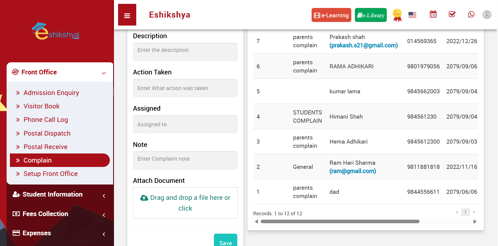
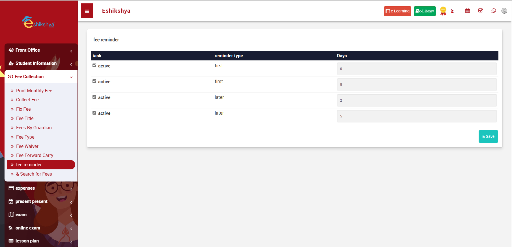

#
##Login
1.	Enter your Username, Password and Click on Sign in to access your account. 
2.	In case you forgot password, Click on Forgot password.
 
<i>Image 1</i>

You should be redirected to this page once you click on Forgot Password:
 
<i>Image 2</i> 
<ol><li>Enter the email linked to your account, a recovery code will be sent to your email.</li>
<li>Enter the recovery code and reset your password. </li></ol>

##Dashboard
Once you login, you should see this page. This is your Dashboard which contains all the data summary and shortcuts to your account. 
 
<i>Image 3</i>
 
<i>Image 4</i>

##Front Desk
###Admission Enquiry

 
<i>Image 5</i>

<b>Add admission enquiry form:</b> 
Fill the details and click on save. The saved details should appear on the List of Admission Enquiries Shown in Image 5.

 
<i>Image 6</i>

###Visitor Book
To check the Visitor List or Add new visitor, Go to Visitor book under Front Office. 

 
<i>Image 7</i>
 
<i>Image 8</i>

###Phone Call log
To check the Phone Call log or Add new Phone call log, Go to Phone Call Log under Front Office. 
 
<i>Image 9</i>

 
<i>Image 10</i>

###Postal Dispatch
To check the Postal Dispatch history or Add new Postal Dispatch log, Go to Postal Dispatch under Front Office. 
 
<i>Image 11</i>
 
<i>Image 12</i>

###Postal Receive
To check the Postal Received history or Add new Postal Receive log, Go to Postal Receive under Front Office. 

<i>Image 13</i>
 
<i>Image 14</i>

###Complain
To view the list of complaints or add new complaints, go to Complain under Front Desk.

<i>Image 15</i>

<i>Image 16</i>

###Setup Front Office
All the list Selection Options in the Front Office field can be set up here. For example, in image 7, Purpose field is a list selection. The list options for Purpose can be set up here.
Same goes for Complain type, Source and Reference. 

<i>Image 17</i>

##Student Information
###Student Details
To narrow down the student searches, Search using filters e.g., Class, Section or Keyword. 

<i>Image 18</i>

Here, Choosing Class 2 to Search gives you the list of students in the 2nd Grade. If you want a Detailed Student Summary, click on Detail View.

<i>Image 19</i>

When clicked on Detail view, it gives you the detail of the students studying in the specific grade, as shown in the screenshot below. 

<i>Image 20</i>
###Student Admissions
In order to add new student admission data, Go to Student Admission under Student Information and Fill in the required Fields.

<i>Image 21</i>

This page should appear once you click on Import Student. 

<i>Image 22</i>

When you scroll down you will find a space to Fill the Class, section field and upload the CSV file. Fill the class and section field, upload your file in the given space and click on Import Student. This will save your student detail file according to Class and section. 

<i>Image 23</i>

###Online Admission
Under Student Information, Click on Online Admission to view the list of Online Admission Requests, Student details and Admission fee payment status, Enrollment status.

<i>Image 24</i>

###Class

<i>Image 25</i>

###Section

<i>Image 27</i>

###Delete Students
Search the student you want to delete with the filter. Once you find the student, select and click on delete. 

<i>Image 28</i>

###Student Categories

<i>Image 28</i>

###Student House

<i>Image 29</i>

###Dropout Students
###Dropout Reason

##Fees Collection
###Print Monthly Fees
To Generate monthly fees of students, Go to <b>Print Monthly Fee</b> under <b>Fees Collection. </b>  
Click on the check box next to <b> Admission No.</b> to select all students or Select the check box next to the Admission No. of the Student you want to choose.  
Then click on <b>Generate.</b>

<i>Image 30</i> 
The Following Page should appear once you click on Generate. Click on <b>Print</b> if you want  to Print the Fees. 

<i>Image 31</i>

###Collect Fees
To update fee collection; Go to <b>Collect Fees</b> under <b>Fees collection.</b> 
Search according to class/ section. 
Select the student From the list shown and click on <b>Collect Fees.</b>

<i>Image 32</i> 
Click on <b> Show All</b> to view the Fee history.

<i>Image 33</i> 
This page should appear once you click on <b> Show All.</b>  
It shows all the fees history including paid/due/partially paid.  

<i>Image 34</i> 
<b>Pay All</b>  
In reference to Image 34, when you click on <b>Pay All</b>, you see a pop up as shown in the picture below. Update the amount and click save. This will clear all the remaining due fees.
  
<i>Image 35</i> 
<b>Pay Selected</b>  
In reference to Image 34, click on the check box on the left to the fee you want to select and click on <b>Pay Selected.</b> This will give you a pop up as shown in the picture below. Update the amount and click save. 

<i>Image 36</i> 
<b>Print Selected</b>  
In reference to Image 34, click on the check box on the left of <b>Fees Group</b> to select all fees from the list OR click on the check box left to the fee you want to select and click on <b>Print Selected.</b> This will give you the receipt of all the selected fees in a printable format. 

<i>Image 37</i> 
<b>Print Today</b>  
In reference to Image 34, click on <b>Print Today</b> to get the receipt of all due fees in a printable format. 

<i>Image 38</i> 

###Assign Fees. 
In reference to the Image 39:   
<ul><li>Different Fee subgroups can be created here.</li>
<li>Select Fee group and Fee type. Enter the fee amount.</li>
<li>If there is a fine to be added, select fine type. </li>
<li>Select <b>percentage</b> if fine type is in percentage. </li>
<li>Enter the percentage, the fine amount will automatically be calculated. </li>
<li>If it is a fix amount, select on <b>Fix amount</b> on <b>Fine Type.</b></li>
<li>Enter the fine amount in the entry field. </li>
<li>Click on save. </li>
<li>The updated fee group should appear on the <b>Fees Master List.</b></li>
<li>Click on the Assign/View student icon under <b>Action.</b></ul>

<i>Image 39</i> 

You should be redirected to the page shown in Image 40 once you click on <b>Assign/ View student</b> icon.

<i>Image 40</i> 
<ul><li>Enter the class, section, month you want to assign the fees to and click on search. </li></ul>

<i>Image 41</i> 
<ul><li>Click on the check box left to <b>All</b> or click on the checkbox left to the student you want to assign the fee to.</li>
<li> Click on <b>Save.</b></li></ul>

###Fees Title
The Created Fees Group appears in the <i>Fees Group List selection</i> shown in Image 40. 
If the list of options in <b>Fees Group</b> in <b>Assign fees</b> lacks something, new option can be added here.

<i>Image 41</i> 

###Fees Type
The created Fees Type appears in the <i>Fees Type List selection</i> shown in Image 40. 
If the list of options in <b>Fees Type</b> in <b>Assign fees</b> lacks something, new option can be added here.

<i>Image 42</i> 

###Fees Waiver
<ul>
<li>Select class, block and fee type and click on search.</li>
<li>List of students should appear as shown in the image below.</li>
<li>Select on the student you want to assign the waiver to.</li>
<li>Click on <b>Save.</b></li>
</ul>

<i>Image 43</i> 

###Fees Carry Forward

<i>Image 44</i> 

###Fee Reminder

<i>Image 45</i> 
