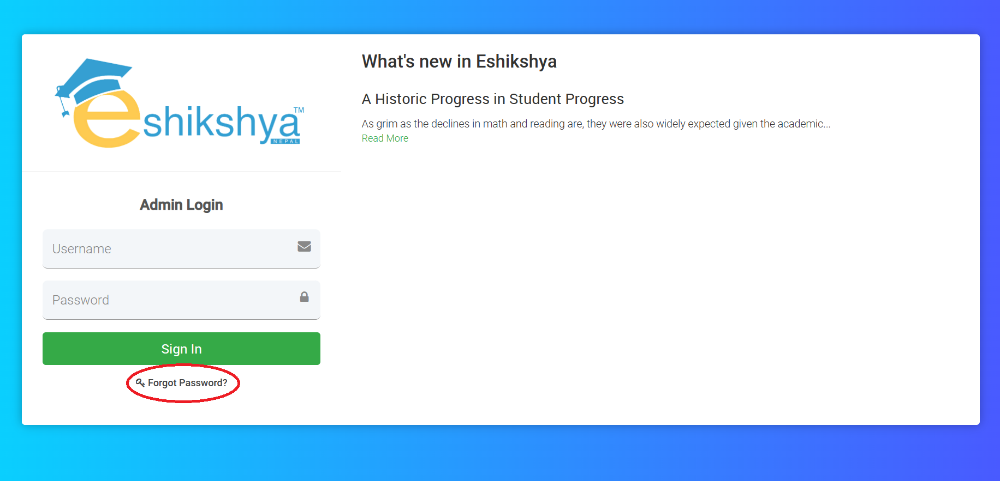
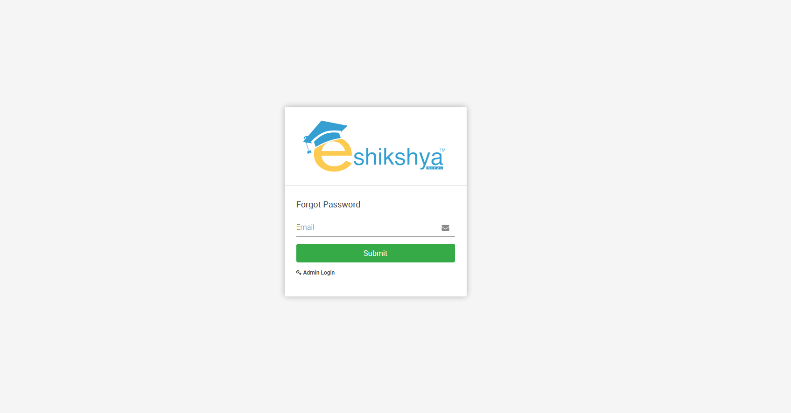

##Login
<ul><li>Enter your Username, Password and Click on Sign in to access your account. </li></ul>
 
<i>Image 1</i>
##Forgot Password
<ul><li>In case you forgot password, on the login page, Click on Forgot password.
<li>You should be redirected to this page once you click on Forgot Password:</li></ul>
 
<i>Image 2</i> 
<ul><li>Enter the email linked to your account, a recovery code will be sent to your email.</li>
<li>Enter the recovery code and reset your password. </li></ul>
